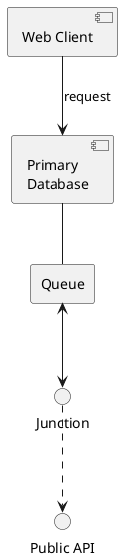
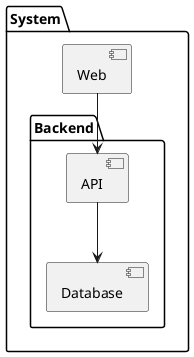
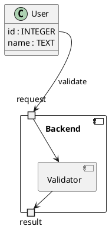

# go-text-diagram

A Go CLI that renders a structural subset of PlantUML as Unicode or ASCII diagrams. It focuses on component diagrams and also supports class member endpoints, component ports, nested groups, DOT input, and DOT or GraphML output.

This is not a complete PlantUML implementation. It requires Go 1.23 or later.

## Example

This diagram was rendered by the CLI from PlantUML. It shows the main packages in its own processing pipeline.

```text
   ┌─ Input ──────────────┐
   │                      │
   │ ┌──────────┐ ┌─────┐ │
   │ │ PlantUML │ │ DOT │ │
   │ └────┬─────┘ └──┬──┘ │
   │      └───┬──────┘    │
   └──────────┼───────────┘
              │
       ┌──────▼──────────┐
       │ go-text-diagram │
       │       CLI       │
       └┳───────────┬────┘
       ┏┛           └┐
┌─ Parse ────────────┼───────┐
│      ┃             ╎       │
│ ┌────▼─────┐ ┌─────▼─────┐ │
│ │ plantuml │ │ exchange  │ │
│ │  parser  │ │ DOT codec │ │
│ └────┬─────┘ └─────┬─────┘ │
│      └──────┐      │       │
└─────────────┼──────┼───────┘
              │      │
              │      │
              ├──────┘
 ┌─ Solve ────┼────────────┐
 │            │            │
 │ ┌──────────▼──────────┐ │
 │ │       layout        │ │
 │ │ ranks & coordinates │ │
 │ └──────────┳──────────┘ │
 │            ┃            │
 │         geometry        │
 │            ┃            │
 │   ┌────────▼─────────┐  │
 │   │      route       │  │
 │   │ orthogonal paths │  │
 │   └────────┬─────────┘  │
 │            │            │
 │        candidate        │
 │            │            │
 │    ┌───────▼───────┐    │
 │    │   solution    │    │
 │    │ best snapshot │    │
 │    └───────┳───────┘    │
 │            ┃            │
 └───────────draw──────────┘
              ┃
     ┌────────▼────────┐
     │     render      │
     │ Unicode / ASCII │
     └─────────────────┘
```

## Quick start

```sh
cat <<'PUML' | go run .
@startuml
A --> B
A --> C
B --> D
C --> D
@enduml
PUML
```

PlantUML input must be enclosed by `@startuml` and `@enduml`.

## Install

```sh
go install github.com/xshoji/go-text-diagram@latest
```

## Usage

```sh
go-text-diagram architecture.puml
go-text-diagram - < architecture.puml
go-text-diagram --ascii architecture.puml
go-text-diagram --max-width=80 architecture.puml
go-text-diagram --debug-layout architecture.puml
go-text-diagram --help
```

The command reads standard input when the input file is omitted or set to `-`.

| Option | Description |
|---|---|
| `--direction=down\|right\|up\|left` | Override the layout direction |
| `--input-format=plantuml\|dot` | Select the input format; the default is `plantuml` |
| `--output-format=diagram\|dot\|graphml` | Select the output format; the default is `diagram` |
| `--ascii` | Draw shapes with ASCII characters |
| `--unicode` | Draw with Unicode box characters; this is the default |
| `--max-width=N` | Split output into panels no wider than `N` terminal cells; `0` disables splitting |
| `--strict` | Reject accepted PlantUML statements that have no rendering effect |
| `--debug-layout` | Print layout, routing, and quality data instead of a diagram |

ASCII mode changes only lines, corners, crossings, and arrows. Labels retain their original characters. Width calculations account for CJK text, combining characters, and emoji.

Rendering options apply only to diagram output. `--strict` applies only to PlantUML input. If an edge label cannot be placed cleanly, the diagram is written to standard output and a warning is written to standard error.

## Input and output formats

PlantUML is the default input format. Select DOT explicitly:

```sh
go-text-diagram --input-format=dot graph.dot
```

Use `--output-format` to convert PlantUML or DOT into DOT or GraphML:

```sh
go-text-diagram --output-format=dot architecture.puml
go-text-diagram --output-format=graphml architecture.puml
```

The old Graph-Easy-style DSL and `--input-format=diagram` are not supported.

## Supported PlantUML subset

### Elements and relations



Supported relation styles include `bold`, `dashed`, `dotted`, and `hidden`. Extra `-` or `.` characters increase the minimum rank distance. Direction hints such as `A -left-> B` and `A -down-> C` control attachment sides. Chained relations such as `A --> B --> C` are rejected.

The diagram direction can be set in the input or overridden from the command line:

```plantuml
top to bottom direction
left to right direction
```

### Nested groups



`package`, `node`, `folder`, `frame`, `cloud`, and `database` create rectangular groups. Groups can be nested and referenced as relation endpoints.

### Classes and component ports



Class members and component ports are structured endpoints. Use `allowmixing` when classes and component-style elements appear in the same diagram.

The parser accepts `skinparam componentStyle rectangle`, `hide empty members`, and `together {}` in normal mode, but they do not affect rendering. Strict mode rejects them.

Unsupported features include:

- sequence, activity, state, and other diagram types
- the PlantUML preprocessor
- notes, legends, titles, colors, fonts, sprites, and images
- stereotypes, multiplicities, and inheritance or aggregation decorations
- multiple `@startuml` blocks
- SVG output or exact PlantUML layout compatibility

Unsupported syntax produces an error with a line and column when available.

## Development

```sh
go test ./...
go vet ./...
```

Run the CLI end-to-end suite with:

```sh
go test . -run '^TestE2E$' -count=1
```

See [`AGENTS.md`](AGENTS.md) for package responsibilities and contribution guidance. E2E scenarios and render snapshots are documented under [`testdata`](testdata).
